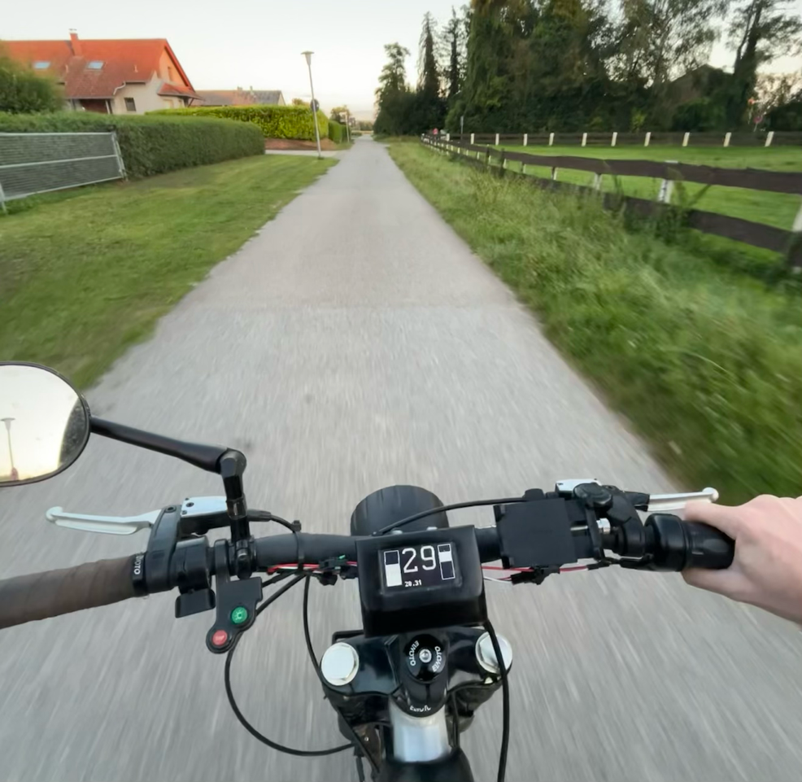
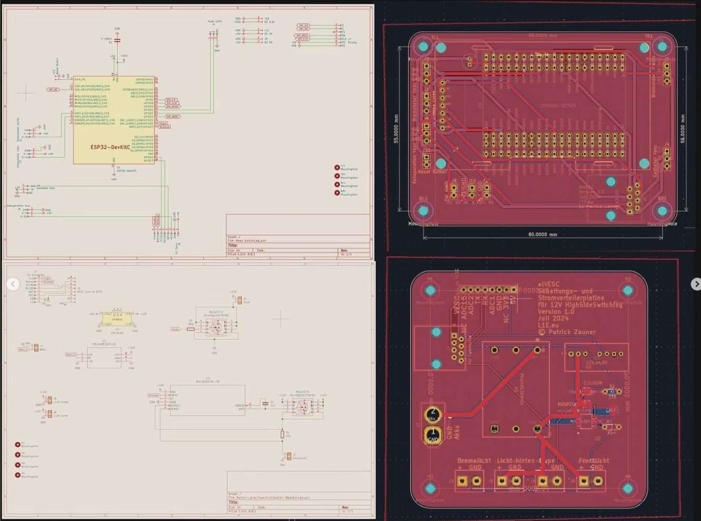
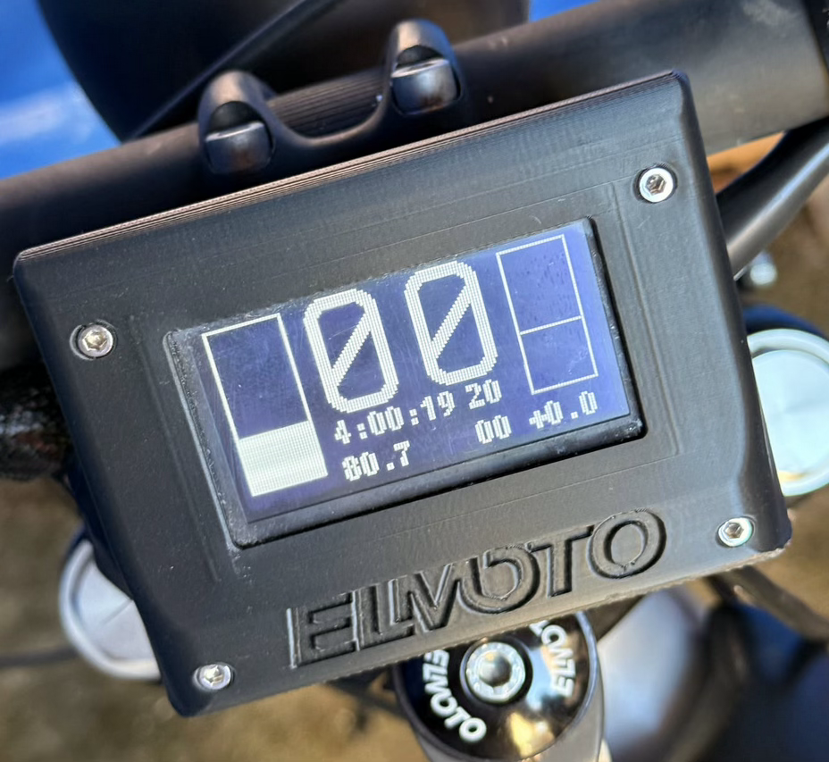
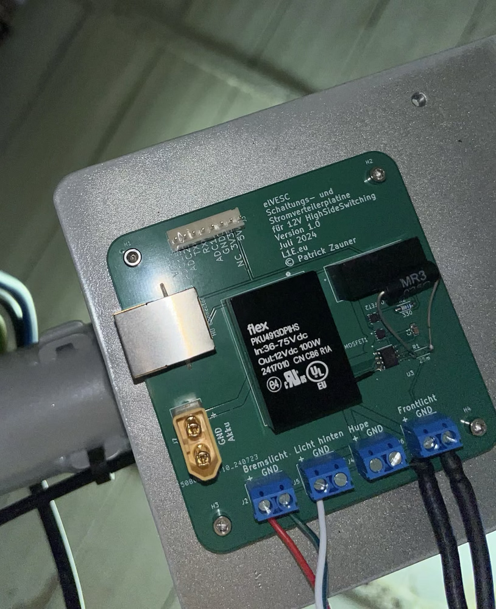

# README

`This is a WIP Project and probably will be merged or extended with other projects in Winter 2025/26`

## Overview

You find the code, flashable on an ESP32 DevKitC with PlatformIO in the submodule.

Everything needed for the PCB inside pcb-schematics.

Link to Onshape Design of Headunit Mount in directory 3d design.
Other project designs will also be added here.

## Core concept

Replacement for original board electronics and an open platform to have a tachometer for any [VESC](https://vesc-project.com/) powered E-Bike.

### Headunit (Display)

#### Implemented and working
Currently working on Tachometer:
- Speed
- Trip Kilometer (resets every power cycle)
- Time since Startup
- Average Speed
- Battery Voltage (mapped to left bar)
- Motor Current (mapped to right bar)
- Motor Power in kW (below right bar)
- Brake Lights
 - triggered when pulling any brake lever
 - also triggered when using regenerative braking above a configurable motor current

Currently all values (wheel diameter, battery voltage, max current, etc.) are hard coded.

Proper way for multiple bikes will be to utilize config files.

#### Implemented but not working
- Average Wh per km consumption
- Horn (probably hardware issue due to bad soldering)

#### Planned
- Odometer (saving distance to ESP32 flash)
- Don't try to calculate values like average speed or  but just get them from VESC

##### Ideas
- Smaller headunit but with more features: Utilizing also an ESP 32 C6 with Zigbee
 - Home Assistant integration
- OTA Updates
- Blinkers but requires more Pins on ESP32 or multiplexing
  - Also requires more than current 8 wires by using a normal RJ45-connector and Ethernet-cable to bottom or serial communication and therefore another microcontroller on the SPDB.

### Switching and Power Distribution Board (SPDB)

Converts high battery voltage to 12V for the headlights and other components. (DC
/DC converter is not cheap, but great quality and has pleanty of headroom)

Also provides 5V for the Headunit: ESP32, Hall-Effect-Brake-Levers and Display. (ESP32 runs on 3V but the dev kit converts the incoming 5V to the usable 3V)

Connects the VESC to the rest of the system.

Turns on Brakelights and also provides power for the 12V lights.

#### Planned
- components with bigger footprints for easier soldering
 - MOSFETs
 - capacitors
 - resistors

#### Ideas

- USB-C in port and DC/DC converter for charging big E-Bike battery (not _really_ practical but I really want this hehe)
- USB-C out port for charging other devices or at least another 12V out to use existing products for this
- Eventually blinkers (my L1E-class-bike came without them from the manufacturer so they are not mandatory)

In combination with Headunit: Serial connection / CAN-BUS based system.
